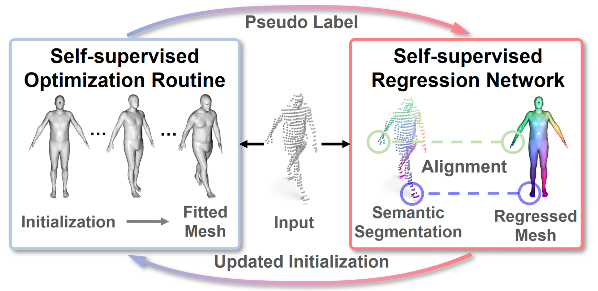

### <div align="center">

## Self-Supervised Human Mesh Recovery from Partial Point Cloud via a Self-Improving Loop (ACM MM 2025)

<p align="center">
  
</p>

</div>

## 🔥 Highlights

* **Strong performance**. SS-HMR achieves state-of-the-art performance on SURREAL, BEHAVE, SLOPER4D datasets. 💪
* **More friendly**. SS-HMR can train all models on less 24G GPU memory (i.e., RTX 3090 are enough to train SS-HMR). 😀

## News
* **2025.07**: SS-HMR has been accepted by ACM MM 2025. 🎉


## Data **Processing**
Prepare parametric human models and related files.

* **SMPL**. Download the SMPL models from [here](https://smpl.is.tue.mpg.de/) and place them under `model/smpl/pytorch/models/`.
* **SMLP-H**. Download the SMPLH models from [here](https://mano.is.tue.mpg.de/) and place them under `model/smplh/native/models/`.

Prepare the data.

* **SURREAL**
  * Download the dataset from [here](https://github.com/gulvarol/surreal) and place them under `data/surreal/`.
* **BEHAVE**
  * Download the dataset from [here](https://github.com/xiexh20/behave-dataset) and place them under `data/BEHAVE/` and download the corresponding project.
  * Move the `dataloadar/SSHMR_BEHAVE_Generate.py` to `behave-dataset/tools` and then run it there.
* **SLOPER4D**
  * Download the dataset from [here](https://github.com/climbingdaily/SLOPER4D) and place them under `data/SLOPER4D/`.
  * Run the `dataloadar/SLOPER4D_Generate.py`

I refactored the code but haven’t tested the data-preprocessing part yet—there might be small issues like wrong paths. I’ll try to fix them as soon as possible.


## Train and Test
* Train all models of SS-HMR on SURREAL
```shell script
python train.py dataset=surreal
```

* Train all models of SS-HMR on BEHAVE
```shell script
python train.py dataset=behave
```

* Train all models of SS-HMR on SLOPER4D
```shell script
python train.py dataset=sloper4d
```

## TODO
- [ ] Streamline external-data preprocessing.

## Citation
```

```

## Acknowledgements
We thank these great works and open-source repositories (in no particular order).

- [PointTransformerV3](https://github.com/Pointcept/https://github.com/Pointcept/PointTransformerV3) 
- [VoteHMR](https://github.com/hanabi7/VoteHMR) 
- [unsupervised3dhuman](https://github.com/wangsen1312/unsupervised3dhuman) 
- [PointNet++](https://github.com/charlesq34/pointnet2) 
- [DPC](https://github.com/dvirginz/DPC)
